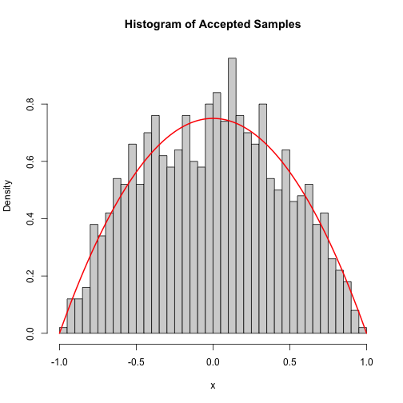
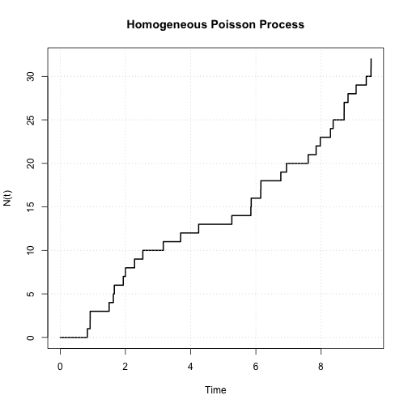

```{=html}
<section class="cinematic-scroll" data-cinematic-scroll>
  <div class="cinematic-pin">
    <div class="cinematic-background" aria-hidden="true"></div>

    <div class="frame-deck" aria-label="UFC scroll image sequence">
      
      
    </div>

    <div class="hero-copy" data-hero-copy>
      <p class="eyebrow">STAT2005 UFC Project</p>
      <h1>UFC Fight Prediction</h1>
      <p>Can height and reach help predict who wins a UFC fight? We tested this using historical fight data and logistic regression.</p>
    </div>

    <div class="scroll-panel" data-scroll-panel>
      <p class="panel-kicker" data-panel-kicker>Frame 1</p>
      <h2 data-panel-title>Fights are messy.</h2>
      <p data-panel-body>Grappling, cage control, pressure, timing, and skill can overpower simple body measurements.</p>
    </div>

    <div class="scroll-meter" aria-hidden="true">
      <span data-scroll-meter></span>
    </div>
  </div>
</section>

<section class="project-summary">
  <div class="summary-card">
    <span>Dataset</span>
    <strong>~6000 UFC fights</strong>
  </div>
  <div class="summary-card">
    <span>Model</span>
    <strong>Logistic regression</strong>
  </div>
  <div class="summary-card">
    <span>Main result</span>
    <strong>Reach mattered, but only slightly</strong>
  </div>
</section>

<section class="report-section" id="problem">
  <div class="section-grid">
    <div>
      <p class="section-kicker">Problem context</p>
      <h2>The fight is more than size</h2>
    </div>
    <div>
      <p>The Ultimate Fighting Championship is unpredictable because fights are shaped by striking range, wrestling, clinch control, submissions, defence, decision-making, and fatigue. This project focuses on two measurable physical characteristics: height and reach.</p>
      <p>A reach advantage may help a fighter strike from further away, while height may affect leverage, distance, and clinch positions. The research question is whether those differences are strong enough to help predict who wins.</p>
      <p>The project also considers the broader idea that prior UFC performance, including win and loss records or streaks, may reflect fighter skill level or mental state. The final implemented model focuses on height and reach differentials because these were the clearest measurable predictors in the analysis.</p>
      <div class="callout"><strong>Research question:</strong> can UFC fight outcomes be predicted using height and reach differentials, or are these physical traits too limited by themselves?</div>
    </div>
  </div>
</section>

<section class="report-section dark" id="objectives">
  <div class="section-grid">
    <div>
      <p class="section-kicker">Objectives</p>
      <h2>What we tested</h2>
    </div>
    <div>
      <ul>
        <li>Determine whether height and reach have a significant impact on UFC fight outcomes.</li>
        <li>Create a model that estimates the probability of a blue-corner win using physical differentials.</li>
        <li>Check whether the model performs meaningfully better than a simple 50/50 prediction.</li>
        <li>Validate the model using historical UFC data and interpret whether the result has practical value for fight analysis.</li>
      </ul>
      <p>The project is statistically useful because it shows how likelihood estimation, logistic regression, and large-scale data can be applied to a real sporting problem. Practically, it may help analysts, coaches, fighters, and betting markets understand whether body measurements provide useful information, while also showing the limits of relying on them alone.</p>
      <div class="metric-grid">
        <div class="metric"><strong>14</strong><span>selected variables</span></div>
        <div class="metric"><strong>2</strong><span>main predictors</span></div>
        <div class="metric"><strong>52.7%</strong><span>joint model accuracy</span></div>
      </div>
    </div>
  </div>
</section>

<section class="report-section" id="literature-review">
  <div class="section-grid">
    <div>
      <p class="section-kicker">Literature review</p>
      <h2>Why modelling UFC outcomes makes sense</h2>
    </div>
    <div>
      <p>Previous research into UFC prediction shows that fight outcomes can be studied using probabilistic models, especially when models include fighter history, physical measurements, and performance statistics. Gavin Walsh's predictive analysis is relevant because it explores whether previous fighter information can help estimate winners.</p>
      <p>Research on anthropometric profiling also supports this project because physical features such as body size, reach, and weight class can influence fighter performance. Holmes, McHale, and Zychaluk similarly showed that mixed martial arts outcomes can be analysed through statistical forecasting rather than only betting odds or personal opinion.</p>
      <p>Our project builds on those ideas by testing a smaller question: whether height and reach differentials alone provide a measurable predictive signal.</p>
    </div>
  </div>
</section>

<section class="report-section dark" id="methodology">
  <div class="section-grid">
    <div>
      <p class="section-kicker">Methodology</p>
      <h2>Logistic regression for a binary result</h2>
    </div>
    <div>
      <p>The project uses a publicly available Kaggle UFC dataset containing historical fight information, fighter measurements, and fight outcomes. Although the dataset contains 144 columns, the analysis focuses on selected fighter identifiers, height, reach, age, win/loss records, weight class, and winner.</p>
      <p>The outcome was converted into a binary variable where a blue-corner win equals 1 and a red-corner win equals 0.</p>
      <pre><code>ufc$outcome &lt;- ifelse(ufc$Winner == "Blue", 1, 0)</code></pre>
      <p>Height and reach differentials were calculated relative to the blue-corner fighter.</p>
      <pre><code>ufc$heightdiff &lt;- ufc$B_Height_cms - ufc$R_Height_cms
ufc$reachdiff  &lt;- ufc$B_Reach_cms  - ufc$R_Reach_cms</code></pre>
      <p>The joint logistic regression model was:</p>
      <pre><code>glm(outcome ~ heightdiff + reachdiff,
    data = ufc_balanced,
    family = binomial(link = "logit"))</code></pre>
      <p>The main assumptions were that measurements are consistent, fights are independent, outcomes are treated as binary wins/losses, and each extra centimetre of height or reach has a constant effect on the log-odds of winning. These assumptions simplify real MMA, but they make the model interpretable.</p>
      <p>Because red-corner fighters won more often in the raw dataset, red wins were randomly downsampled to match the number of blue wins. This created a balanced dataset so the model did not simply learn a red-corner baseline advantage.</p>
    </div>
  </div>
</section>

<section class="report-section" id="results">
  <div class="section-grid">
    <div>
      <p class="section-kicker">Results</p>
      <h2>Reach stayed significant. Height did not.</h2>
    </div>
    <div>
      <p>When height and reach were modelled separately, both appeared to have some relationship with winning. However, once both variables were included together, height became statistically insignificant while reach remained significant.</p>
      <p>Before modelling, the project inspected height and reach differential distributions using histograms, Q-Q plots, and Shapiro-Wilk tests. The distributions were roughly centred around zero and visually close enough for the project purpose, although the formal Shapiro-Wilk test rejected strict normality because the dataset was large.</p>
      <table class="model-table">
        <thead>
          <tr><th>Predictor</th><th>Joint model result</th><th>Interpretation</th></tr>
        </thead>
        <tbody>
          <tr><td>Height differential</td><td>p = 0.478</td><td>Not statistically reliable once reach is included.</td></tr>
          <tr><td>Reach differential</td><td>p = 0.000132</td><td>Small but statistically significant positive effect.</td></tr>
          <tr><td>Joint model accuracy</td><td>52.73%</td><td>Only slightly better than a coin flip.</td></tr>
        </tbody>
      </table>
      <div class="metric-grid">
        <div class="metric"><strong>0.0203</strong><span>joint reach coefficient</span></div>
        <div class="metric"><strong>0.478</strong><span>height p-value</span></div>
        <div class="metric"><strong>0.6904</strong><span>log-loss</span></div>
      </div>
      <p>The confidence interval for height included 1, meaning its true effect could be positive, negative, or zero. The confidence interval for reach stayed above 1, supporting the conclusion that reach has a small but real effect.</p>
    </div>
  </div>
  <div class="figure-row">
    <figure class="figure-card">
      
      <figcaption>Distribution and diagnostic visualisation from the project outputs.</figcaption>
    </figure>
    <figure class="figure-card">
      
      <figcaption>Model visualisation showing how predictor differentials relate to win probability.</figcaption>
    </figure>
  </div>
</section>

<section class="report-section dark" id="interpretation">
  <div class="section-grid">
    <div>
      <p class="section-kicker">Interpretation</p>
      <h2>Signal, not certainty</h2>
    </div>
    <div>
      <p>The results suggest that height and reach are not enough to reliably predict a UFC fight outcome on their own. Height had no meaningful effect in the joint model, likely because UFC fights occur across striking, clinch, wrestling, and ground exchanges where height can be neutralised.</p>
      <p>Reach showed the stronger effect. This makes practical sense because a longer reach can allow a fighter to strike from safer range. However, the advantage is often reduced by closing distance, wrestling, footwork, pressure, and technical skill.</p>
      <div class="callout">Physical traits give a clue, but not a reliable prediction by themselves.</div>
    </div>
  </div>
</section>

<section class="report-section" id="strengths-limitations">
  <div class="section-grid">
    <div>
      <p class="section-kicker">Strengths and limitations</p>
      <h2>What worked and what held the model back</h2>
    </div>
    <div>
      <h3>Strengths</h3>
      <ul>
        <li>The study used a large real-world UFC dataset rather than a tiny sample.</li>
        <li>Logistic regression matched the binary win/loss structure of the problem.</li>
        <li>The model was interpretable, making it clear how each centimetre of reach changed the log-odds of winning.</li>
      </ul>
      <h3>Limitations</h3>
      <ul>
        <li>The model only used height and reach, ignoring skill, style, recent form, injuries, striking accuracy, takedown defence, and other fight-specific factors.</li>
        <li>The model assumed a linear relationship between physical advantages and log-odds of winning.</li>
        <li>The final accuracy was only around 52.7%, meaning the model was not practically reliable for prediction.</li>
      </ul>
    </div>
  </div>
</section>

<section class="report-section dark" id="future-work">
  <div class="section-grid">
    <div>
      <p class="section-kicker">Future work</p>
      <h2>A better model needs better fight features</h2>
    </div>
    <div>
      <p>Future work could improve predictive performance by adding variables that better describe fighter ability and matchup context. Useful extensions include age, weight class, previous UFC records, win/loss streaks, significant strikes landed per minute, striking defence, takedown average, takedown defence, submission attempts, stance, and recent activity.</p>
      <p>The modelling approach could also be extended beyond simple logistic regression. Interaction terms, nonlinear logistic models, random forests, or other machine learning methods may capture relationships that a linear log-odds model cannot.</p>
    </div>
  </div>
</section>

<section class="report-section" id="conclusion">
  <p class="section-kicker">Conclusion</p>
  <h2>Final takeaway</h2>
  <div class="conclusion-grid">
    <article class="conclusion-card">
      <h3>Results</h3>
      <p>Height became insignificant in the joint model, while reach remained statistically significant with a small positive effect.</p>
    </article>
    <article class="conclusion-card">
      <h3>Limits</h3>
      <p>The model predicted only slightly above chance, showing that physical traits alone cannot explain UFC outcomes.</p>
    </article>
    <article class="conclusion-card">
      <h3>Extensions</h3>
      <p>Future models should include technical performance, fighter history, weight class, and more flexible nonlinear methods.</p>
    </article>
    <article class="conclusion-card">
      <h3>Practical use</h3>
      <p>Reach is worth considering in analysis, but it should not be used alone for betting, coaching decisions, or serious prediction.</p>
    </article>
  </div>
  <p>Overall, this study found that physical advantages alone are not strong enough to reliably predict the outcome of a UFC fight. Reach differential is the more useful physical predictor, but the joint model's 52.7% accuracy shows that the effect is modest and not enough for dependable forecasting.</p>
</section>

<section class="report-section dark" id="contributions">
  <div class="section-grid">
    <div>
      <p class="section-kicker">Contribution statements</p>
      <h2>Project roles</h2>
    </div>
    <div>
      <ul>
        <li>P. Lew: Methodology, writing, review and editing, model implementation and results.</li>
        <li>L. Mondi: Methodology, writing, introduction and background, review and editing, web design.</li>
        <li>E. Yap: Methodology, writing, model implementation and results, review and editing.</li>
      </ul>
    </div>
  </div>
</section>

<section class="report-section dark" id="references">
  <div class="section-grid">
    <div>
      <p class="section-kicker">References</p>
      <h2>Sources</h2>
    </div>
    <div>
      <ul>
        <li>UFC. (2018). <em>History of UFC</em>. https://www.ufc.com/history-ufc</li>
        <li>Australian Institute of Health and Welfare. (2023). <em>Gambling in Australia</em>. https://www.aihw.gov.au/reports/australias-welfare/gambling</li>
        <li>Walsh, G. <em>Predictive Analysis of UFC Fights</em>.</li>
        <li>Holmes, M., McHale, I., &amp; Zychaluk, K. (2023). Probabilistic forecasting methods for mixed martial arts outcomes.</li>
      </ul>
    </div>
  </div>
</section>

<script src="scroll-frames.js"></script>
```
